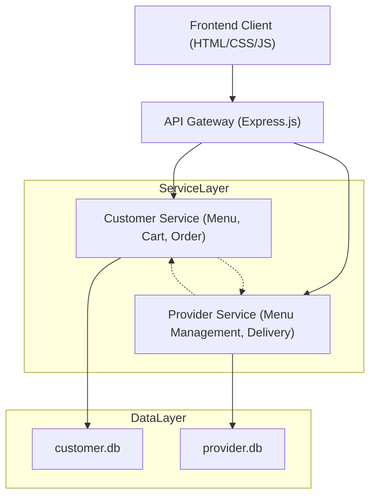

# WAD

```mermaid
graph TB
    Client["Frontend Client (HTML/CSS/JS)"] --> Gateway["API Gateway (Express.js)"]
    
    Gateway --> CS["Customer Service (Menu, Cart, Order)"]
    Gateway --> PS["Provider Service (Menu Management, Delivery)"]
    
    CS -.-> PS
    PS -.-> CS
    
    subgraph ServiceLayer
        CS
        PS
    end

    subgraph DataLayer
        CDB["customer.db"]
        PDB["provider.db"]
    end
    
    CS --> CDB
    PS --> PDB

```

